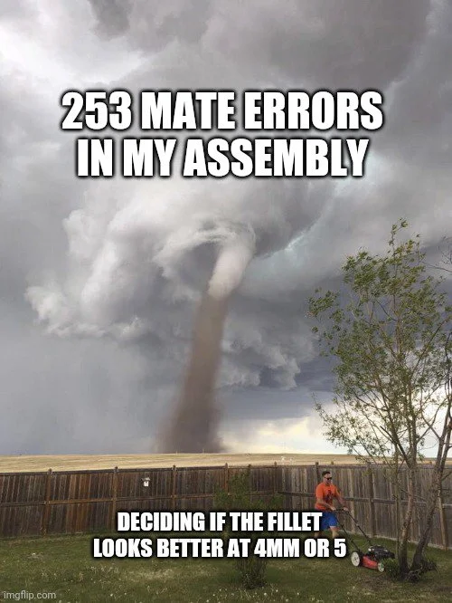
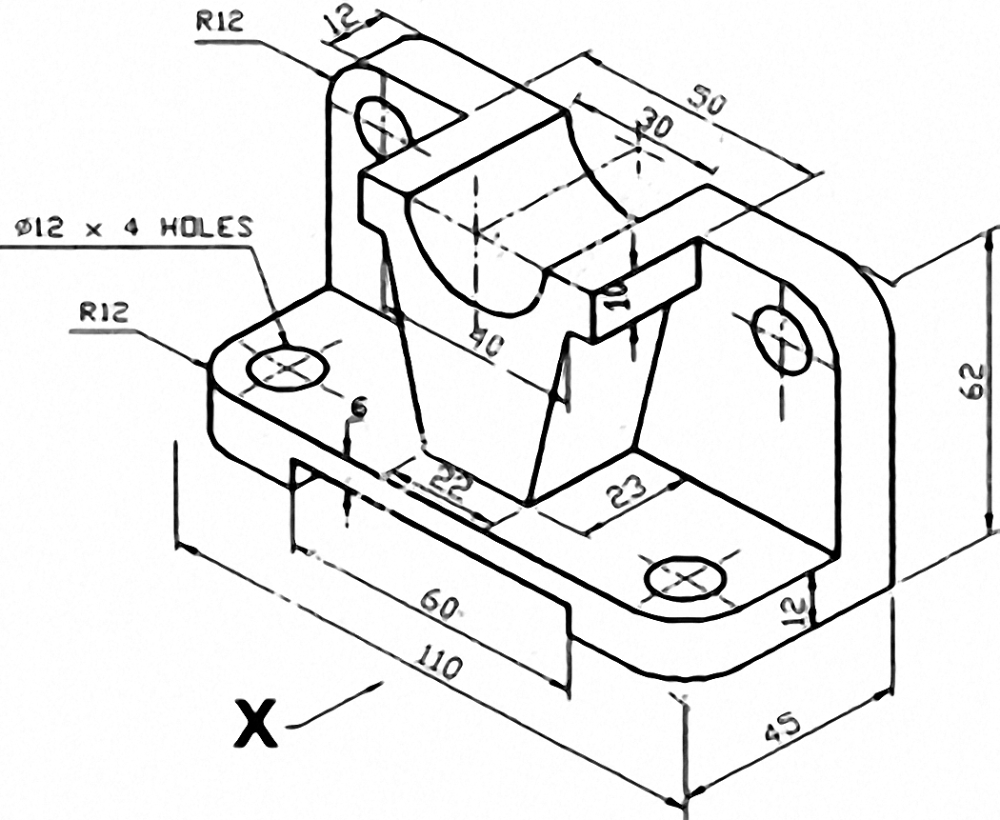
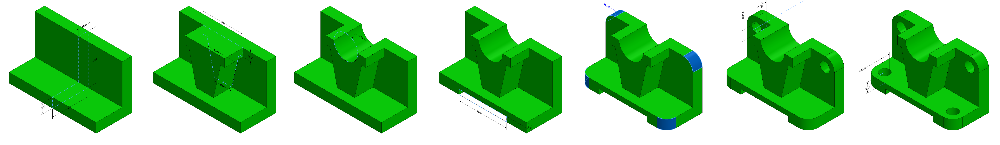
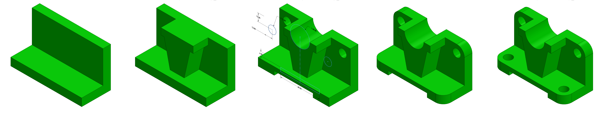
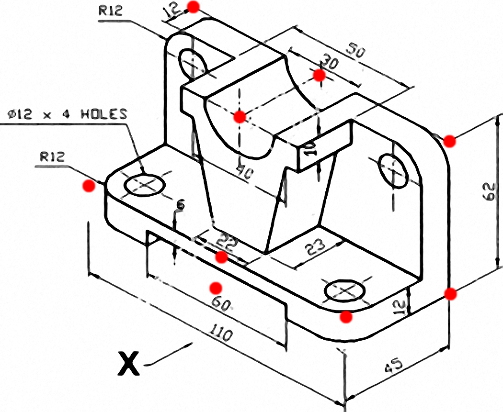
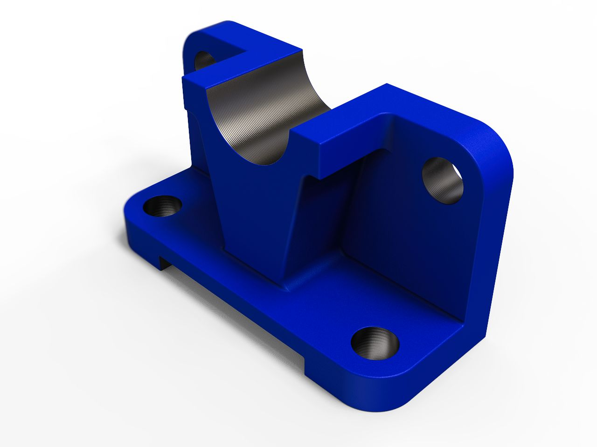

# HDS-SummerCamp21

## How to build a Robot 101

Before we can get to fabricate a robot, it goes thorugh dozens of iterations, starting with the analysis of Kinematic Links (GeoGebra) to a CAD model(SW, Fusion) to URDF. It then gets its controls before being tested in simulation environments.
### "To become good at anything you have to know how to apply basic principles. To become great at it, you have to know when to violate those principles." -Gary Kasparov
## Create, Iterate, Repeat.

## The whole is greater than the sum of its parts -Aristotle

By the end of this week, you will start to find parts that may be look challenging at first, but try to break it down into simpler geometries.

### This part can be broken down into following basic operations

Above are the seven steps I used to create this model. Notice I started with an "L" shape instead of a rectangle. I broke the rule about putting fillets last. But the drawing locates the four holes concentrically with the filleted corners, so that's how I made the model.

Is this really the "Correct" way to make the model? It does not matter. If the model is correct, easy to edit, and built in a logical sequence, an argument for it being wrong, or bad can't be made. Pretty much like writing good code.

Reducing the feature count from 7 to 5 (image above) creates a more complex multi-profile sketch for the third step. If you are later asked to suppress (turn off) one or more of those individual cuts, the process would be more difficult when compared to the seven step example above where each cut is made with a separate feature.

## Where does the origin go?

The origin is the fixed point in the CAD system located at the intersection of the three primary reference plane (front, top, right). The origin has a coordinate position of 0,0,0 in the model space. (Will be useful when exporting URDFs)

### Where should the origin go?

This is a hard question to answer for two reasons.

   * It varies with every model.
   * It really doesn't matter (most of the time).

To resolve the first issue above, we'll focus only on this model.

To resolve the 2nd issue, there are a number of bad places to put the origin, and a number of better places to put it. But, even if you pick the wrong location, it is possible to add another origin to the model later. And sometimes you may want multiple origins (an example is using one for CAD modeling, but a different origin to indicate the part in CNC equipment).

As a general rule, always put the origin *in the middle* of a symmetrical part. 

## The fun part
Making CAD models should be sexy. If not, you might be studying for the wrong profession.

When your 3D model is complete, and you've checked it for errors, make a rendering of it. Rendering an image makes it look much better by applying realistic materials, backgrounds, and lighting to and around the model.

## If you made it so far, Good Start. You can now head to week 1! 

